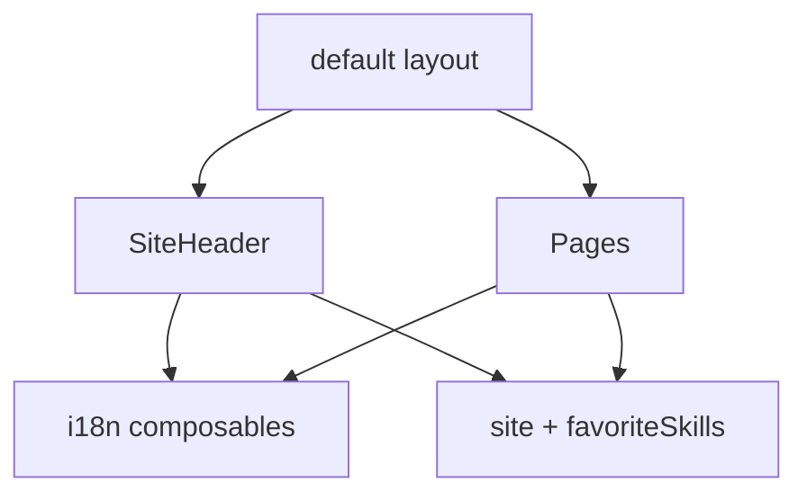

# 模块拆解规划

本文档描述**当前仓库模块划分与推荐开发顺序**，属于 [第二层：外部 Spec](01-项目主Spec.md#文档三层与归档)。与 [01-项目主Spec.md](./01-项目主Spec.md) 路由一致；**实现细节以源码与第一层注释为准**。

- **模块级 Spec 模板与约定**：[`modules/README.md`](modules/README.md)（边界 / 交互 / 验收，不抄代码）。
- **历史快照（第三层）**：[`archive/README.md`](archive/README.md)。

## 1. 模块一览

| 模块 | 路径 / 位置 | 第二层模块 Spec | 当前职责 |
|------|-------------|-----------------|----------|
| 布局壳 | `app/layouts/default.vue` | — | 全站布局、`html lang`、内容区宽度、顶栏与浮层插槽 |
| 顶栏 | `app/components/SiteHeader.vue` | — | 导航、`navRoutes`、GitHub、时钟占位、设置按钮 |
| 首页 | `app/pages/index.vue` | — | 头像、标题、打字机 tagline、关于段落 |
| 项目页 | `app/pages/project/index.vue` | 待定 [`module-project-spec.md`](modules/README.md) | 占位，后续接项目列表或详情 |
| 博客页 | `app/pages/blogs/index.vue` | 待定 [`module-blogs-spec.md`](modules/README.md) | 占位，后续接文章列表或 MD 源 |
| 收藏页 | `app/pages/favorites/index.vue` | — | Skills 等分区展示 |
| 收藏数据 | `app/constants/favoriteSkills.ts` | — | Skills 条目（第一层数据源，见文件内注释） |
| 站点常量 | `app/constants/site.ts` | — | 站点名、头像、GitHub、导航路由表（第一层） |
| i18n | `app/i18n/messages.ts`、`useAppI18n.ts`、`useAppLocale.ts` | — | 文案与语言切换 |
| 全局组件 | `SiteFloatActions.vue`、`LiveClock.client.vue`、`TypewriterText.vue` 等 | — | 语言切换、回顶、时钟、打字效果 |

## 2. 依赖关系（简图）

## 3. 推荐开发 / 演进顺序

1. **布局与导航**：`default.vue`、`SiteHeader`、`site.ts` 路由表与 i18n 导航文案一致。
2. **首页内容**：与 `messages` 中 about 段落、站点常量同步。
3. **收藏页**：维护 `favoriteSkills.ts`；后续可增加其它分区（新常量文件 + `favorites/index.vue` 分区）。
4. **项目页**：从占位 → 静态数据或 JSON → 按需拆 `docs/modules/module-project-spec.md`。
5. **博客页**：从占位 → 内容源方案确定（如 `content/`、远程 API）→ 按需拆 `docs/modules/module-blogs-spec.md`。

## 4. 后续子模块 Spec（第二层钩子）

当某一栏目功能复杂化时，在 [`docs/modules/`](modules/README.md) 按模板新增 `module-<领域>-spec.md`，例如：

- `module-blogs-spec.md`：文章源、路由、列表/详情、SEO（只写边界与验收，不贴实现）。
- `module-project-spec.md`：项目数据结构（概念层）、展示与外链规则。

新增或重大变更时：更新上表「第二层模块 Spec」列，并在 [01-项目主Spec.md](./01-项目主Spec.md) 中若有边界变化则同步。
